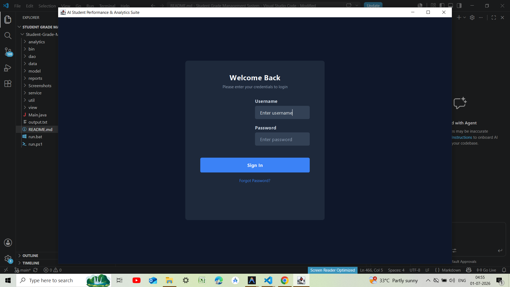
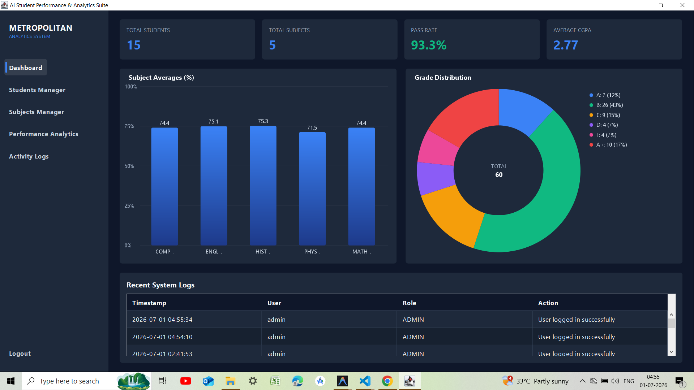
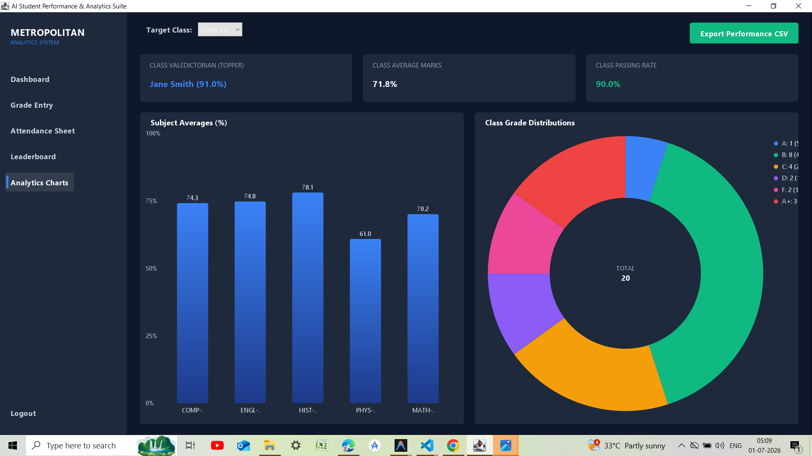
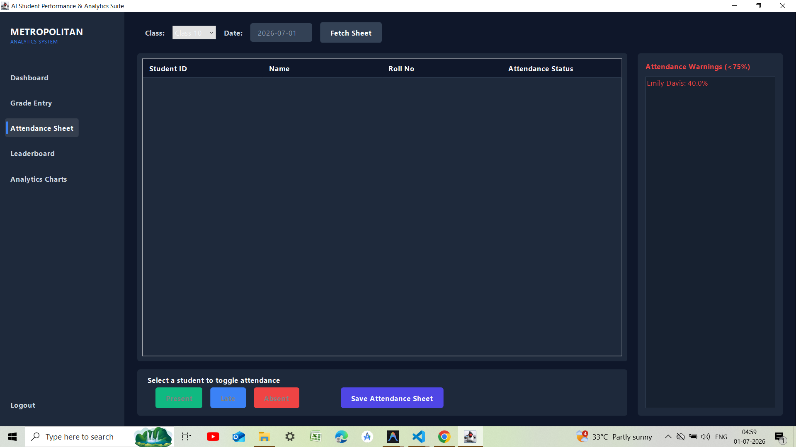
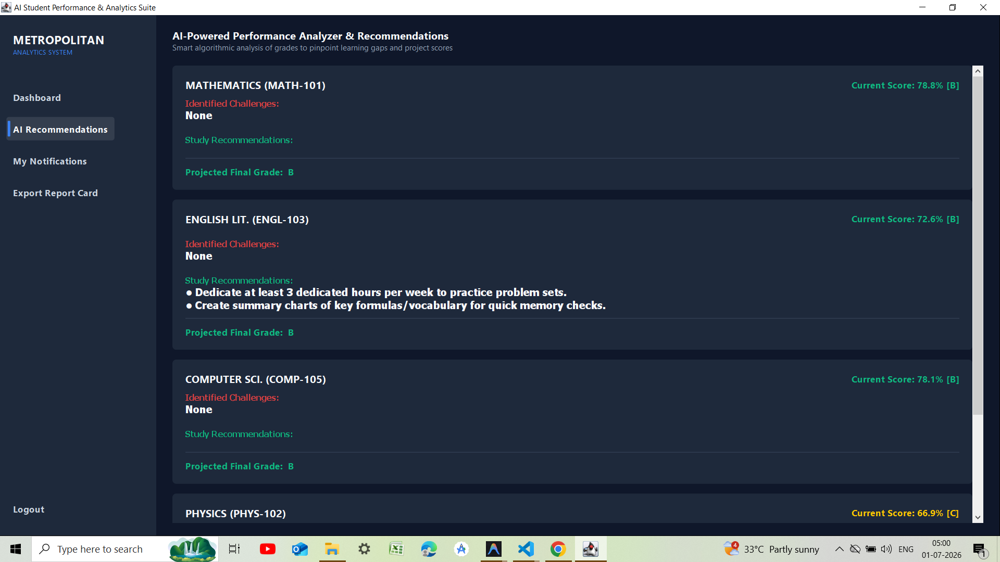
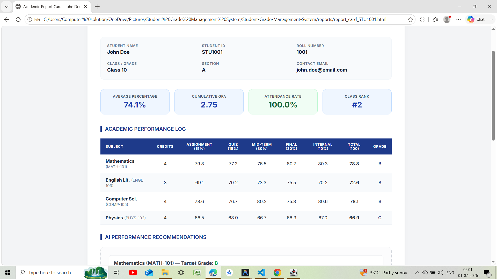

# 🎓 AI-Powered Smart Student Performance Analytics System

<p align="center">


</p>

A modern **institutional-grade desktop application** built entirely with **Core Java** and **Java Swing** for managing student performance, attendance, grading, analytics, and academic reporting.

The project follows professional software engineering principles including **MVC Architecture**, **DAO Pattern**, **Role-Based Access Control (RBAC)**, **SHA-256 Authentication**, **multithreading**, and **custom Graphics2D visual analytics** without relying on external libraries.

---

# ✨ Highlights

- 🔐 Secure Role-Based Authentication (Admin, Teacher, Student)
- 📊 Real-time Academic Analytics Dashboard
- 📈 Interactive Graphics2D Charts
- 🤖 AI-Based Study Recommendations
- 🎯 Automatic GPA & Grade Calculation
- 🏆 Student & Subject Ranking System
- 📅 Attendance Tracking & Monitoring
- 📄 HTML Report Card Generator
- 📑 CSV Report Export
- âš¡ Multithreaded Report Processing
- 🔒 SHA-256 Password Encryption
- 💾 Native CSV Database (No SQL Required)
- 🧩 Clean MVC + DAO Architecture

---

# 🖼️ Application Screenshots

> Replace the image paths below with your own Screenshots.

## 🔐 Login Screen

<p align="center">

</p>

---

## 📊 Admin Dashboard

<p align="center">

</p>

---

## 👨‍🏫 Teacher Dashboard

<p align="center">

</p>

---

## 🎓 Student Dashboard

<p align="center">

</p>

---

## 📈 Analytics Dashboard

<p align="center">

</p>

---

## 📉 Performance Charts

<p align="center">

</p>

---

## 📝 Marks Management

<p align="center">

</p>

---

## 📅 Attendance Management

<p align="center">

</p>

---

## 🤖 AI Study Recommendations

<p align="center">

</p>

---

## 📄 Generated HTML Report Card

<p align="center">

</p>

---

# 🚀 Features

## 🔐 Authentication & Security

- Role-Based Access Control (RBAC)
- Secure login system
- SHA-256 password hashing
- Session management
- Activity logging
- Password recovery using security questions

---

## 👨‍🎓 Student Management

- Student CRUD
- Auto-generated Student IDs
- Automatic portal account creation
- Student search & filtering
- Cascade deletion support

---

## 📚 Subject Management

- Subject CRUD
- Automatic Subject IDs
- Enrollment management
- Student-Subject junction table
- Cascade cleanup

---

## 📝 Assessment & Grading

### Weighted Assessment System

| Component | Weight |
|-----------|---------|
| Assignments | 15% |
| Quizzes | 15% |
| Mid-Term | 30% |
| Final Exam | 30% |
| Internal Evaluation | 10% |

Features

- Automatic percentage calculation
- Letter grade generation
- GPA calculation
- Class ranking
- Subject ranking
- Performance trends

---

## 🎓 GPA Scale

| Grade | GPA |
|------|------|
| A+ | 4.0 |
| A | 3.7 |
| B | 3.0 |
| C | 2.0 |
| D | 1.0 |
| F | 0.0 |

---

## 📅 Attendance System

- Daily attendance
- Present / Absent / Late
- Attendance percentage
- Warning notifications
- Attendance history

---

## 📊 Analytics Dashboard

Custom Graphics2D visualizations include:

- 📊 Bar Charts
- 📈 Line Graphs
- 🍩 Donut Charts

Analytics include:

- Subject averages
- Grade distributions
- Student comparisons
- Performance trends
- Class statistics

---

## 🤖 AI Performance Analysis

The built-in AI module automatically analyzes student performance and provides intelligent recommendations.

### Features

- Detects weak subjects
- Identifies poor-performing assessments
- Predicts final grades
- Personalized study advice
- Homework completion suggestions
- Test preparation recommendations

---

## 📄 Report Generation

Runs on background threads to ensure the Swing interface remains responsive.

### CSV Reports

- Student Grades
- GPA Reports
- Subject Statistics
- Attendance Reports

### HTML Report Cards

Professional printable report cards containing:

- Student Profile
- Grades
- GPA
- Attendance
- Charts
- AI Recommendations
- Signature Blocks

---

# 🏗️ Project Architecture

```
                +-------------------+
                |       View        |
                |   Java Swing UI   |
                +---------+---------+
                          |
                          |
                +---------v---------+
                |     Services      |
                | Business Logic    |
                +---------+---------+
                          |
                +---------v---------+
                |        DAO        |
                | CSV File Storage  |
                +---------+---------+
                          |
                +---------v---------+
                |      Models       |
                |      POJOs         |
                +-------------------+
```

Architecture Patterns

- MVC
- DAO
- Service Layer
- Object-Oriented Design
- Layered Architecture

---

# 📂 Project Structure

```text
Student-Grade-Management-System/
│
├── analytics/
├── dao/
├── data/
├── model/
├── reports/
├── service/
├── util/
├── view/
│
├── Screenshots/
│   ├── login.png
│   ├── admin-dashboard.png
│   ├── teacher-dashboard.png
│   ├── student-dashboard.png
│   ├── analytics.png
│   ├── charts.png
│   ├── attendance.png
│   ├── marks.png
│   ├── ai-recommendation.png
│   └── report-card.png
│
├── Main.java
├── run.ps1
├── run.bat
└── README.md
```

---

# ⚙️ Requirements

- Java JDK 17+
- Windows 10/11
- PowerShell or Command Prompt

Tested on

- OpenJDK 26

---

# ▶️ Running the Project

## PowerShell (Recommended)

```powershell
.\run.ps1
```

If PowerShell blocks execution:

```powershell
powershell -ExecutionPolicy Bypass -File .\run.ps1
```

---

## Command Prompt

```cmd
run.bat
```

Or simply double-click **run.bat**.

---

# 🔑 Default Login Credentials

| Role | Username | Password |
|------|----------|----------|
| 👑 Admin | admin | admin123 |
| 👨‍🏫 Teacher | teacher | teacher123 |
| 🎓 Student | stu1001 | student123 |

All student accounts (`stu1001` → `stu1015`) use:

```
Password: student123
```

---

# 🧪 Automated Testing

The project includes a built-in unit testing framework.

Execute:

```powershell
Get-ChildItem -Recurse -Filter *.java |
Resolve-Path -Relative |
Out-File -Encoding ascii sources.txt

& "C:\Users\Computer solution\.jdks\openjdk-26.0.1\bin\javac.exe" `
-encoding UTF-8 -d bin "@sources.txt"

Remove-Item sources.txt

& "C:\Users\Computer solution\.jdks\openjdk-26.0.1\bin\java.exe" `
-cp bin util.TestRunner
```

Expected Output

```
TEST RUN COMPLETE

30 / 30 ASSERTS PASSED

SUCCESS
```

---

# 💡 Technologies Used

- Java
- Java Swing
- Graphics2D
- Core Java
- MVC Architecture
- DAO Pattern
- CSV File Storage
- SHA-256
- Multithreading
- HTML/CSS
- Object-Oriented Programming

---

# 🎯 Future Enhancements

- 📱 Mobile Companion App
- ☁ Cloud Database Support
- 📧 Email Notifications
- 📊 PDF Report Generation
- 🔍 Advanced Search Filters
- 🌙 Dark Mode
- 🌐 REST API Integration
- 🔔 Live Notifications
- 📈 Machine Learning Grade Prediction

---

# ⭐ Project Showcase

This project demonstrates practical implementation of:

- Enterprise Desktop Development
- MVC Architecture
- DAO Pattern
- File-Based Database Systems
- Data Visualization
- AI-Based Analytics
- Java Multithreading
- Authentication & Security
- Professional UI Development
- Academic Performance Analytics

---

<p align="center">

### ⭐ If you found this project helpful, consider giving it a star!

**Made with ❤️ using Java & Java Swing**

</p>